# 금리차 디커플링 구간에서 단기 유동성이 원/달러 환율 변동에 미치는 영향 분석

부제: Anomaly Block 기반 임계점 가설 및 Granger 인과성 검증

작성일: 2026년 5월 18일  
프로젝트 경로: `/Applications/dollar_price`

---

# 목차

## 제 1장 서론
### 제 1절 연구 배경 및 문제 정의
### 제 2절 연구 목적 및 연구 질문
### 제 3절 보고서 구성

## 제 2장 이론적 배경 및 데이터 소개
### 제 1절 환율 결정 이론과 단기 유동성
### 제 2절 수집 데이터 및 출처
### 제 3절 데이터 전처리 및 분석 데이터셋 구성
### 제 4절 Anomaly Block 정의

## 제 3장 연구 방법
### 제 1절 전체 연구 절차
### 제 2절 상관관계 및 SHAP 분석 방법
### 제 3절 단기 유동성 임계점 분석 방법
### 제 4절 Granger Causality 분석 방법
### 제 5절 예측 모델 검증 방법

## 제 4장 분석 결과
### 제 1절 장기 환율 요인 및 Anomaly Block 분석
### 제 2절 SHAP 기반 환율 변동 요인 분석
### 제 3절 M2 구성요소 및 단기 유동성 분석
### 제 4절 단기 유동성 임계점 가설 검증
### 제 5절 Granger Causality 분석 결과
### 제 6절 예측 모델을 통한 설명력 검증
### 제 7절 환율 영향 분석 확장

## 제 5장 종합 논의
### 제 1절 연구 결과 종합
### 제 2절 연구의 의의
### 제 3절 연구의 한계

## 제 6장 결론 및 향후 연구 방향
### 제 1절 결론
### 제 2절 향후 연구 방향

## 참고문헌
### 국내문헌
### 국외문헌
### 데이터 출처

## 부록
### 부록 1. 주요 변수 설명
### 부록 2. 분석 코드 및 실행 절차
### 부록 3. 추가 분석 결과표

---

# 제 1장 서론

## 제 1절 연구 배경 및 문제 정의

원/달러 환율은 한국 경제에서 매우 중요한 거시금융 변수이다. 환율은 수입물가, 수출입 채산성, 외국인 자금 흐름, 국내 자산가격, 기업의 환헤지 비용, 통화정책 판단 등에 직접적인 영향을 준다. 특히 한국처럼 대외 개방도가 높고 원자재 및 중간재 수입 비중이 큰 경제에서는 환율 상승이 단순한 금융시장 가격 변동에 그치지 않고 물가, 투자심리, 무역수지, 소비심리까지 이어지는 파급 경로를 가진다. 따라서 환율 변동의 원인을 설명하고, 특정 국면에서 어떤 변수가 환율을 더 잘 설명하는지 파악하는 것은 정책적·실무적 가치가 크다.

전통적으로 원/달러 환율을 설명할 때 자주 사용되는 변수 중 하나는 한미 금리차이다. 이자율 평가설에 따르면 양국 간 금리 차이는 자본 이동과 기대 환율 변화를 통해 환율에 영향을 미친다. 예를 들어 한국 금리가 미국 금리보다 상대적으로 높으면 원화 표시 자산의 수익률이 높아져 원화 수요가 증가하고, 그 결과 원화 강세 또는 원/달러 환율 하락 압력이 발생할 수 있다. 반대로 미국 금리가 더 높거나 달러 자산의 매력이 커지는 경우에는 달러 수요가 증가해 원/달러 환율 상승 압력이 발생할 수 있다.

그러나 실제 환율은 항상 금리차만으로 설명되지 않는다. 특히 금융위기, 팬데믹, 글로벌 긴축, 위험회피 심리 확대, 국내 유동성 불안과 같은 비정상적 시장 국면에서는 금리차와 환율 간 관계가 약화되거나 방향이 뒤바뀌는 현상이 나타날 수 있다. 본 프로젝트는 이러한 문제의식에서 출발하였다. 즉, 장기 평균적으로는 금리차와 환율 사이에 일정한 관계가 관찰되더라도, 금리차 설명력이 약화되는 특정 구간에서는 다른 변수가 환율 움직임을 더 잘 설명할 수 있다는 가설을 세웠다.

초기 분석에서는 최근 고환율 구간을 고정된 기간으로 설정하여 정상구간과 비교하는 방식이 사용되었다. 하지만 고정기간 방식은 연구자가 사전에 특정 시작일과 종료일을 정해야 하며, 디커플링이 실제로 발생한 날짜와 분석 기간이 정확히 일치하지 않을 수 있다는 한계가 있다. 또한 금리차와 환율의 관계 붕괴는 하나의 긴 사건으로만 나타나는 것이 아니라, 여러 시점에 짧고 긴 블록으로 반복될 수 있다. 따라서 본 최종 보고서에서는 특정 달부터 특정 달까지를 이상구간으로 고정하는 방식보다, 금리차와 환율이 실제로 디커플링되는 구간을 데이터 기반으로 탐지하고 이어붙인 anomaly block 방식을 중심으로 분석한다.

본 연구가 주목한 대체 설명 변수는 단기 유동성이다. 특히 M2 내부의 수시입출식저축성예금, 요구불예금, MMF와 같이 빠르게 현금화되거나 이동할 수 있는 단기성 자금은 외환시장 불안 국면에서 달러 수요로 전환될 가능성이 있다. 이러한 자금은 평상시에는 환율과 강한 선형 관계를 보이지 않을 수 있지만, 특정 규모 이상의 유동성 충격이 발생하면 환율에 비선형적 상승 압력을 줄 수 있다. 본 연구는 이 관점을 “단기 유동성 임계점 가설”로 정리하고, 상관관계 분석, SHAP 분석, threshold regression, Granger causality, LSTM 기반 예측 검증을 통해 확인한다.

## 제 2절 연구 목적 및 연구 질문

본 연구의 목적은 한미 금리차로 환율을 설명하기 어려운 anomaly block 구간에서 단기 유동성 변수가 환율 움직임을 어느 정도 설명할 수 있는지 검증하는 것이다. 여기서 anomaly block은 환율과 한미 금리차 사이의 전통적 관계가 약화되거나 디커플링되는 구간을 의미한다. 본 연구는 단순히 최근 특정 고환율 기간을 분석하는 데 그치지 않고, 장기간 데이터에서 금리차 설명력이 약화되는 구간을 체계적으로 추출한 뒤 그 구간에서의 환율 결정 구조를 분석한다.

첫 번째 연구 질문은 “장기적으로 환율과 주요 거시경제 변수는 어떤 관계를 보이는가?”이다. 이를 위해 환율, 금리차, M2, CPI, 산업생산 등 주요 변수 간 피어슨 상관관계를 확인하고, 장기 구간에서 관찰되는 평균적 관계를 정리한다. 이 단계는 이후 anomaly block 분석을 위한 기준점을 제공한다.

두 번째 연구 질문은 “금리차와 환율이 디커플링되는 구간에서는 어떤 변수가 환율 움직임을 더 잘 설명하는가?”이다. 이를 위해 정상적 관계가 작동하지 않는 anomaly block을 정의하고, 해당 구간에서 Random Forest 및 SHAP 분석을 수행한다. 특히 선형 상관관계에서는 뚜렷하지 않은 변수가 비선형 모델에서는 중요한 기여도를 보이는지 확인한다.

세 번째 연구 질문은 “단기 유동성의 환율 영향은 선형적인가, 아니면 임계점을 가진 비선형 구조인가?”이다. 본 연구는 MMF와 CMA 등 일별 단기 유동성 데이터를 활용하여 threshold regression과 SHAP dependence plot을 확인한다. 이를 통해 유동성이 조금씩 증가할 때 환율이 비례적으로 반응하는지, 아니면 특정 수준을 넘는 순간 환율 반응이 급격히 커지는지 검토한다.

네 번째 연구 질문은 “단기 유동성은 환율을 선행하는가?”이다. 상관관계나 변수 중요도는 변수 간 관련성을 보여줄 수 있지만, 시간 순서를 직접 설명하지는 못한다. 따라서 본 연구는 Granger causality 검정을 통해 anomaly block 내부에서 M2 변화가 환율 변화를 예측하는 데 유의한 정보를 제공하는지, 반대로 환율 변화가 M2 변화를 선행하는지도 함께 검토한다.

마지막 연구 질문은 “단기 유동성 변수를 추가한 예측 모델은 금리차 단독 모델보다 이상구간 설명력이 개선되는가?”이다. 환율은 자기상관이 강한 시계열이므로 직전 환율을 그대로 따라가는 naive baseline은 매우 강한 기준선이 될 수 있다. 따라서 본 연구에서 예측 모델의 핵심 평가는 naive baseline과의 단순 우열이 아니라, 금리차 단독 모델과 금리차에 단기 유동성 변수를 추가한 모델 사이의 상대적 설명력 차이에 초점을 둔다.

## 제 3절 보고서 구성

본 보고서는 총 6장으로 구성된다. 제 1장은 연구 배경, 문제 정의, 연구 목적을 설명한다. 여기서는 금리차 기반 환율 설명 방식의 의의와 한계, 그리고 단기 유동성에 주목하게 된 배경을 정리한다.

제 2장은 이론적 배경과 데이터 소개를 다룬다. 환율 결정 이론, 통화량과 환율의 관계, 단기 유동성 개념을 정리하고, 본 프로젝트에서 사용한 데이터의 출처, 단위, 빈도, 전처리 과정을 설명한다. 또한 본 연구의 핵심 분석 단위인 anomaly block이 어떻게 정의되는지 소개한다.

제 3장은 연구 방법을 설명한다. 전체 연구 파이프라인, 상관관계 분석, Random Forest 및 SHAP 분석, threshold regression, Granger causality, LSTM 및 Hybrid 예측 모델의 목적과 설계를 정리한다. 이 장은 제 4장의 분석 결과를 이해하기 위한 방법론적 기반을 제공한다.

제 4장은 분석 결과를 제시한다. 장기 환율 요인 분석, anomaly block 분석, SHAP 기반 변수 기여도, M2 구성요소 분석, 단기 유동성 임계점 검증, Granger causality 결과, 예측 모델 검증, 환율 영향 분석 확장을 순서대로 설명한다. 본 보고서의 핵심 결과는 제 4장 제 4절과 제 5절, 즉 임계점 가설 검증과 Granger causality 분석에 집중되어 있다.

제 5장은 종합 논의이다. 개별 분석 결과를 통합하여 단기 유동성이 금리차 설명력이 약화되는 구간에서 어떤 의미를 갖는지 해석하고, 연구의 의의와 한계를 정리한다. 제 6장은 결론과 향후 연구 방향을 제시하며, 단기 유동성 기반 환율 리스크 조기경보 시스템으로의 확장 가능성을 논의한다.

---

# 제 2장 이론적 배경 및 데이터 소개

## 제 1절 환율 결정 이론과 단기 유동성

환율은 두 통화의 상대 가격이며, 금리, 물가, 통화량, 성장률, 위험선호, 자본 이동, 정책 기대 등 다양한 요인에 의해 결정된다. 이 중 금리차는 전통적으로 환율 분석에서 중요한 변수로 사용된다. 금리차가 자본 이동에 영향을 주고, 자본 이동이 외환 수급을 변화시키며, 외환 수급 변화가 환율에 반영된다는 논리이다. 특히 한국과 미국처럼 금융시장이 개방되어 있고 달러 자금 흐름의 영향이 큰 경제에서는 한미 금리차가 원/달러 환율을 설명하는 주요 변수로 자주 사용된다.

그러나 금리차가 환율을 항상 안정적으로 설명하는 것은 아니다. 위기 상황에서는 투자자가 금리 수익률보다 안전자산 선호, 유동성 확보, 외화 조달 안정성, 정책 불확실성을 더 중요하게 고려할 수 있다. 이 경우 한국 금리가 상대적으로 높더라도 원화 자산으로 자금이 유입되지 않거나, 오히려 달러 수요가 증가해 환율이 상승할 수 있다. 즉 금리차의 방향성과 환율의 방향성이 전통적 설명과 달라지는 디커플링 현상이 발생할 수 있다.

통화량과 유동성은 이러한 비정상 국면을 설명하는 대체 경로가 될 수 있다. M2는 현금통화, 요구불예금, 수시입출식저축성예금, 정기예적금, MMF 등 다양한 유동성 자산을 포함하는 광의통화 지표이다. M2 전체는 경제 내 통화량 수준을 나타내지만, 모든 구성요소가 외환시장에 같은 속도로 영향을 미치는 것은 아니다. 예를 들어 장기성 예금이나 만기성 상품은 즉각적인 이동성이 낮은 반면, 요구불예금, 수시입출식저축성예금, MMF는 빠르게 현금화되거나 다른 자산으로 이동할 수 있다.

본 연구는 이러한 차이에 주목한다. 단기 유동성은 평상시에는 환율과 뚜렷한 선형 관계를 보이지 않을 수 있다. 하지만 불확실성이 높아지고 달러 강세 기대가 커지는 국면에서는 대기성 자금이 외환시장으로 빠르게 이동할 수 있으며, 이때 환율에 비선형적 압력이 발생할 수 있다. 따라서 본 연구의 핵심 가설은 “금리차가 환율을 설명하지 못하는 anomaly block 구간에서는 단기 유동성이 환율 움직임을 상당히 설명할 수 있으며, 특히 특정 임계점을 넘을 때 환율 반응이 급격히 커진다”는 것이다.

이 가설은 단순한 상관관계 분석만으로 충분히 검증되기 어렵다. 단기 유동성과 환율의 관계가 비선형적이라면 전체 표본의 피어슨 상관계수는 낮게 나타날 수 있다. 또한 유동성 변화가 환율 변화보다 먼저 나타나는지 확인하려면 시간 순서에 대한 검정이 필요하다. 따라서 본 연구는 Pearson correlation, Random Forest, SHAP, threshold regression, Granger causality, LSTM 예측 모델을 결합하여 단기 유동성의 설명력을 다각도로 검토한다.

## 제 2절 수집 데이터 및 출처

본 프로젝트는 `data/` 폴더에 저장된 원천 및 처리 데이터를 사용하였다. 데이터는 한국은행 경제통계시스템, FRED, 수동 수집 CSV/XLSX, 프로젝트 내부 전처리 결과로 구성된다. 주요 데이터는 환율, 정책금리, 10년물 국채금리, M2 및 M2 구성요소, CPI, 산업생산지수, KOSPI, 외국인 투자, BSI/CSI 등이다.

환율 데이터는 `data/exchange_rate/`에 저장되어 있으며, 처리 결과는 `USD_KRW_processed.csv`와 `exchange_rate_processed.csv`로 사용된다. 정책금리는 한국 기준금리와 미국 FEDFUNDS를 사용하며, 두 값을 결합해 `RATE_SPREAD_KOR_USA`를 생성한다. M2 데이터는 한국 M2와 미국 M2를 포함하며, 한국 M2의 경우 총량뿐 아니라 MMF, 수시입출식저축성예금, 요구불예금, 현금통화 등 세부 구성요소가 처리되어 있다.

단기 유동성 분석에는 `data/m2/KOR/merged_daily_liquid.csv`가 사용된다. 이 데이터셋은 일별 환율과 MMF_total을 포함한다. 과거 일부 스크립트에서는 CMA와 MMF를 합친 M2 proxy를 사용한 흔적이 있으나, 현재 확인된 처리 데이터 `merged_daily_liquid.csv`는 `observation_date`, `USD_KRW`, `MMF_total` 3개 컬럼으로 구성되어 있다. 따라서 CMA 관련 세부 수치는 기존 결과 문서와 코드의 맥락을 함께 확인하여 해석해야 하며, 최종 수치 사용 시 원천 파일 재확인이 필요하다.

월별 거시경제 확장 데이터는 `data/macro_dataset_processed.csv`와 `data/integrated_macro_targets.csv`에 저장되어 있다. 이 데이터셋은 USD/KRW, 수출, 수입, 무역수지, 경상수지, CPI, 수입물가지수, 산업생산, 실업률, M2, MMF, 요구불예금, 정책금리, DXY, VIX, WTI, 금리차, KOSPI, 외국인 주식·채권 투자, BSI, CSI 등 다양한 변수를 포함한다. 각 변수에 대해 MoM, YoY, lag 변수가 다수 생성되어 후속 분석에 활용된다.

| 구분 | 주요 변수 | 파일 예시 | 빈도 | 비고 |
|---|---|---|---|---|
| 환율 | USD_KRW, FX_rate | `data/exchange_rate/USD_KRW_processed.csv` | 일별 | 원/달러 환율 |
| 금리 | BASE_RATE_KOR, FEDFUNDS, RATE_SPREAD_KOR_USA | `data/policy_rate/spread_KOR_USA_processed.csv` | 일별/월별 | 한미 정책금리차 |
| 통화량 | M2_KOR, M2_USA | `data/processed_daily_1995_2026_integrated.csv` | 일별 보간 | 장기 통합 분석 |
| M2 구성요소 | MMF, 수시입출식저축성예금, 요구불예금 | `data/m2/KOR/M2_details_processed.csv` | 월별 | 단기성 자금 분석 |
| 단기 유동성 | MMF_total | `data/m2/KOR/merged_daily_liquid.csv` | 일별 | 임계점 및 LSTM 분석 |
| 거시 타깃 | CPI, KOSPI, 무역수지, 외국인 투자 | `data/integrated_macro_targets.csv` | 월별 | 환율 영향 확장 분석 |

## 제 3절 데이터 전처리 및 분석 데이터셋 구성

데이터 전처리는 주로 `data/process_scripts/` 폴더의 스크립트에서 수행된다. `process_all_indicators.py`는 한국은행 원천 CSV처럼 날짜가 열 방향으로 펼쳐진 넓은 형식 데이터를 읽어 특정 계정항목을 필터링하고, `observation_date`와 값 컬럼으로 구성된 분석용 데이터로 변환한다. 이 과정에서 날짜 형식 통일, 쉼표 제거, 숫자형 변환, 필요한 컬럼 추출이 이루어진다.

`rebuild_daily_pipeline.py`는 현재 데이터 파이프라인에서 핵심적인 역할을 한다. 이 스크립트는 일별 환율 원천 파일을 읽어 `USD_KRW` 시계열을 만들고, 한국 기준금리와 미국 정책금리를 결합해 `RATE_SPREAD_KOR_USA`를 계산한다. 또한 실제 환율과 양국 금리로 이론적 선물환율(`THEORETICAL_FWD_RATE`)을 계산하고, 한국 M2 세부 구성요소를 월별 wide format으로 정리한다. MMF 일별 데이터가 존재하는 경우에는 환율과 결합하여 일별 유동성 데이터셋을 생성한다.

`create_daily_integrated_dataset.py`는 환율, 정책금리차, 한국 M2, 미국 M2를 일별 인덱스에 맞추어 결합한다. 환율과 금리차는 전방·후방 보간 또는 유지 방식으로 결측을 채우고, 월별 M2는 선형 보간을 통해 일별로 변환한다. 결과 파일인 `data/processed_daily_1995_2026_integrated.csv`는 1995년 1월 1일부터 2026년 3월 20일까지 11,402행, 5개 컬럼(`date`, `FX_rate`, `policy_spread`, `M2_KOR`, `M2_USA`)으로 구성되어 있다.

월별 거시경제 분석에는 `data/macro_dataset_processed.csv`와 `data/integrated_macro_targets.csv`가 사용된다. 확인 결과 `macro_dataset_processed.csv`는 375행, 166개 컬럼으로 구성되어 있으며, 기간은 1995년 1월 31일부터 2026년 3월 31일까지이다. `integrated_macro_targets.csv`는 금융 지표가 추가되어 375행, 171개 컬럼으로 구성되어 있다. 이 데이터셋은 `fx_impact` 분석에서 환율 충격이 KOSPI, 수입물가, 무역수지, 외국인 투자 등에 미치는 영향을 분석하는 데 사용된다.

| 데이터셋 | 행 수 | 열 수 | 기간 | 주요 용도 |
|---|---:|---:|---|---|
| `processed_daily_1995_2026_integrated.csv` | 11,402 | 5 | 1995-01-01 ~ 2026-03-20 | anomaly block 탐지, 장기 일별 분석 |
| `merged_daily_liquid.csv` | 7,922 | 3 | 1995-01-03 ~ 2026-03-20 | MMF 일별 유동성 분석 |
| `M2_details_processed.csv` | 373 | 8 | 1995-01-01 ~ 2026-01-01 | M2 구성요소 분석 |
| `macro_dataset_processed.csv` | 375 | 166 | 1995-01-31 ~ 2026-03-31 | 월별 거시 변수 분석 |
| `integrated_macro_targets.csv` | 375 | 171 | 1995-01-31 ~ 2026-03-31 | 환율 영향 확장 분석 |
| `anomaly_concatenated_dataset.csv` | 3,588 | 8 | 1995-01-31 ~ 2026-03-20 | anomaly block 결합 분석 |

본 프로젝트의 데이터 처리에서 중요한 기술적 이슈는 빈도 불일치이다. 환율과 일부 금융 변수는 일별 데이터인 반면, M2와 CPI, 산업생산 등 다수 거시 변수는 월별 데이터이다. 본 연구는 분석 목적에 따라 일별 모델에서는 월별 지표를 일별로 보간하고, 월별 영향 분석에서는 일별 예측 환율을 월말 또는 월평균으로 변환하여 결합한다. 이러한 변환은 불가피하지만, 해석 시 데이터 빈도와 보간이 결과에 미치는 영향을 고려해야 한다.

## 제 4절 Anomaly Block 정의

본 연구에서 가장 중요한 설계 중 하나는 이상구간 정의이다. 초기 보고서와 일부 실험에서는 `2024-11~2025-12` 또는 `2024-11~2026-03`처럼 최근 고환율 기간을 고정된 이상구간으로 설정했다. 이 방식은 직관적이고 설명이 쉽지만, 연구자가 사전에 정한 기간이 실제 금리차-환율 디커플링 구간과 정확히 일치한다고 보장하기 어렵다. 또한 금리차 설명력이 약화되는 현상은 최근에만 나타나는 것이 아니라 과거 여러 위기·불안 구간에서도 반복될 수 있다.

따라서 최종 보고서에서는 고정기간 방식보다 anomaly block 방식을 중심으로 한다. `analysis/anomaly/period_definition.json`에 따르면 anomaly block은 `processed_daily_1995_2026_integrated.csv`를 대상으로 환율과 정책금리차의 30일 rolling correlation을 계산하고, 상관계수가 설정 임계값 이하로 내려가는 구간을 추출하여 구성된다. 현재 설정은 rolling window 30일, correlation threshold -0.2, 최소 연속일 기준 30일이다. 이 방식은 금리차와 환율의 관계가 전통적 설명과 달라지는 구간을 데이터 기반으로 탐지한다는 장점이 있다.

확인된 `period_definition.json` 기준으로 전체 데이터 범위는 1995년 1월 1일부터 2026년 3월 20일까지이며, anomaly block은 총 668개, 전체 anomaly day는 3,588일이다. 첫 anomaly block 시작일은 1995년 1월 31일이고 마지막 종료일은 2026년 3월 20일이다. 이 블록들은 하나의 연속된 사건이 아니라 여러 시점에 흩어진 디커플링 구간이며, 본 연구에서는 이들을 공통된 “금리차 설명력이 약화된 시장 상태”로 보고 결합해 분석한다.

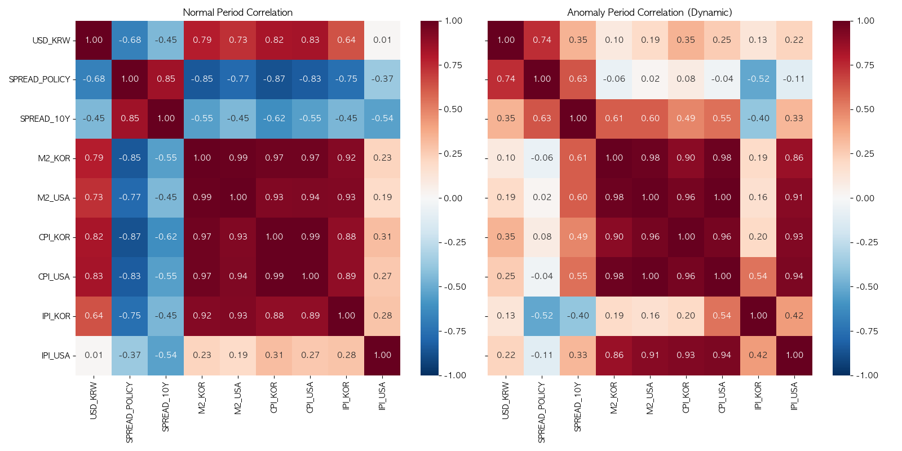

다만 anomaly block을 이어붙이는 방식에는 주의가 필요하다. 서로 떨어진 날짜를 하나의 시계열처럼 연결하면 실제 달력상의 시간 간격이 사라지고, `shift(1)`이나 차분 계산에서 왜곡이 생길 수 있다. 본 프로젝트는 이러한 문제를 인식하고, Granger causality 분석에서는 블록 내부에서만 변화율을 계산하여 블록 경계에서 발생할 수 있는 가짜 점프를 제거했다. `fx_impact` 최종 파이프라인에서도 anomaly-only 시계열을 단순히 이어붙이는 방식의 한계를 지적하고 event-time local projection으로 보완하려는 시도가 이루어졌다.

---

# 제 3장 연구 방법

## 제 1절 전체 연구 절차

본 연구는 데이터 수집 및 전처리, 장기 관계 분석, anomaly block 정의, SHAP 기반 요인 분석, M2 구성요소 분석, 단기 유동성 임계점 검증, Granger causality 분석, 예측 모델 검증, 환율 영향 확장 분석의 순서로 진행되었다. 이 흐름은 `README.md`에 정리된 Phase 구조와 각 `analysis/*/result.md` 파일의 분석 결과를 바탕으로 재구성한 것이다.

첫 번째 단계는 데이터 수집 및 전처리이다. 한국은행, FRED, 수동 다운로드 데이터에서 환율, 금리, M2, CPI, 산업생산, KOSPI, 외국인 투자 등 데이터를 수집하고, 프로젝트 내부 스크립트를 통해 분석 가능한 CSV로 변환한다. 이 단계에서는 날짜 형식 통일, 계정항목 필터링, 숫자형 변환, 결측치 처리, 월별-일별 빈도 변환이 수행된다.

두 번째 단계는 장기 분석이다. 장기간 데이터에서 환율과 주요 거시 변수 간 상관관계를 확인하여 금리차, M2, CPI 등이 환율과 어떤 관계를 보이는지 파악한다. 이 단계는 정상적인 평균 관계를 파악하기 위한 기준 분석이며, 이후 anomaly block 분석과 비교하는 기준점으로 사용된다.

세 번째 단계는 anomaly block 정의와 이상구간 분석이다. 환율과 한미 금리차의 rolling correlation을 사용하여 디커플링 구간을 찾고, 해당 구간을 결합한 anomaly dataset을 구성한다. 이후 정상구간과 anomaly block의 상관구조 차이를 비교하여 금리차 설명력이 약화되는 구간의 특징을 확인한다.

네 번째 단계는 단기 유동성 가설 검증이다. Random Forest 및 SHAP 분석을 통해 anomaly block에서 환율 변동에 기여한 변수를 확인하고, M2 구성요소 분석으로 어떤 종류의 통화가 증가했는지 분해한다. 이어서 일별 MMF/CMA 기반 threshold regression과 SHAP dependence plot을 통해 임계점 가설을 검토한다.

다섯 번째 단계는 시계열 선행성 및 예측 검증이다. Granger causality 분석을 통해 M2 변화가 환율 변화를 선행하는지 확인하고, LSTM 및 Hybrid 모델을 통해 금리차 단독 모델과 단기 유동성 추가 모델의 이상구간 설명력을 비교한다. 마지막으로 `fx_impact` 분석은 환율 예측 또는 환율 충격이 국내 거시·금융 변수로 어떻게 파급되는지 탐색하는 확장 단계로 배치된다.


| 연구 단계 | 주요 파일 | 방법 | 산출물 |
|---|---|---|---|
| 데이터 전처리 | `data/process_scripts/*.py` | 날짜 정리, 병합, 보간 | processed CSV |
| 장기 분석 | `analysis/baseline/analyze_factors.py` | Pearson correlation, RF | heatmap, result.md |
| anomaly 탐지 | `analysis/anomaly/*.py` | rolling correlation | period JSON, anomaly CSV |
| SHAP 분석 | `analysis/shap_ml/analyze_shap.py` | RF, SHAP | SHAP plot |
| M2 분석 | `analysis/m2_components/*.py` | 구성요소 분해, Granger | bar plot, result |
| 임계점 검증 | `analysis/daily_threshold_MMF/*.py` | threshold regression | threshold plot |
| 예측 검증 | `analysis/LSTM/*` | LSTM, Hybrid | metrics, prediction plots |
| 확장 분석 | `analysis/fx_impact/*` | lead-lag, LP, VARX | impact reports |

## 제 2절 상관관계 및 SHAP 분석 방법

상관관계 분석은 환율과 주요 거시 변수 간 선형 관계를 확인하기 위해 사용되었다. `analysis/baseline/analyze_factors.py`는 USD/KRW, 정책금리차, 10년물 금리차, 한국 M2, 미국 M2, 한국 CPI, 미국 CPI, 한국 산업생산, 미국 산업생산 등을 병합한 뒤 피어슨 상관계수 행렬을 계산한다. 또한 Random Forest Regressor를 사용하여 환율 수준을 설명하는 변수 중요도를 산출한다.

상관관계 분석의 장점은 해석이 직관적이라는 점이다. 계수가 양수이면 해당 변수가 상승할 때 환율도 상승하는 경향이 있고, 음수이면 반대로 움직이는 경향이 있다고 해석할 수 있다. 하지만 피어슨 상관계수는 선형 관계만 포착한다. 만약 유동성이 일정 수준까지는 환율에 큰 영향을 주지 않다가 특정 임계점을 넘은 뒤 급격히 영향을 준다면, 전체 구간의 선형 상관계수는 낮게 나타날 수 있다.

이 한계를 보완하기 위해 SHAP 분석을 사용하였다. `analysis/shap_ml/analyze_shap.py`는 정상구간 데이터를 사용해 Random Forest 모델을 학습하고, anomaly period 또는 anomaly block에 해당하는 데이터에 대해 SHAP value를 계산한다. SHAP은 각 변수가 모델 예측값을 얼마나 상승 또는 하락시키는지 기여도를 계산하는 설명가능 AI 기법이다. 따라서 단순 변수 중요도보다 특정 구간에서 어떤 변수가 환율 상승에 기여했는지 더 세밀하게 해석할 수 있다.

본 연구에서 SHAP 분석은 특히 중요하다. 기존 결과 문서에 따르면 선형 상관관계에서는 이상구간 내 M2와 환율의 관계가 낮게 나타났지만, Random Forest 및 SHAP 분석에서는 M2, 특히 단기성 자금 계열 변수가 환율 상승에 중요한 변수로 나타났다. 이 차이는 단기 유동성과 환율의 관계가 단순 선형 관계가 아닐 수 있음을 보여주는 단서로 해석된다.

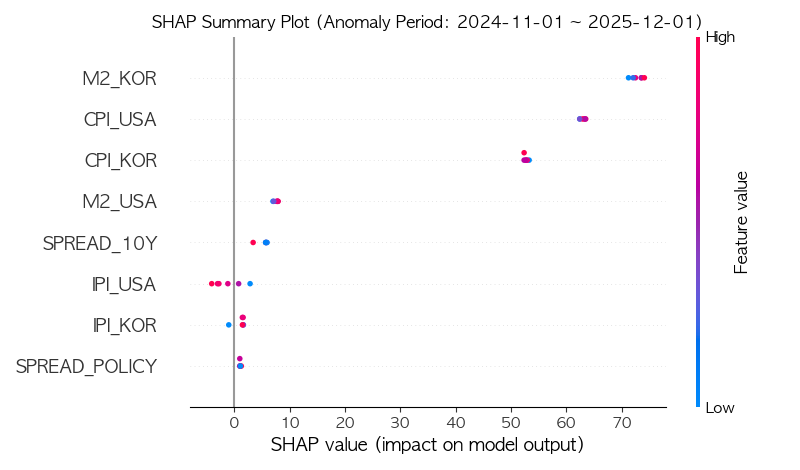

## 제 3절 단기 유동성 임계점 분석 방법

단기 유동성 임계점 분석은 선형 상관관계와 SHAP 결과 사이의 차이를 설명하기 위해 설계되었다. 기본 가설은 “M2 또는 단기 유동성이 증가할수록 환율이 항상 같은 비율로 상승하는 것이 아니라, 일정 수준까지는 영향이 제한적이다가 특정 임계치를 넘으면 환율 반응이 급격히 커진다”는 것이다. 이 가설은 환율과 유동성의 관계를 비선형적 체제 전환 문제로 바라본다.

`analysis/daily_threshold_MMF/analyze_daily_threshold.py`는 일별 단기 유동성 데이터와 환율 데이터를 사용하여 threshold regression을 수행한다. 코드상으로는 일별 환율 변화량(`delta_ER`)과 단기 유동성 변화량(`delta_M2`)을 계산하고, 양의 유동성 충격 중 여러 후보 threshold를 탐색한다. 각 threshold에 대해 threshold 초과 여부 더미(`D_tau`)와 상호작용항을 포함한 OLS 회귀를 적합하고, 잔차제곱합이 가장 작은 threshold를 찾는다.

이 분석은 유동성 변화량이 특정 수준을 넘는 날과 그렇지 않은 날의 환율 반응이 구조적으로 다른지 확인한다. 만약 threshold 더미와 상호작용항이 유의미하다면, 유동성 충격이 단순한 선형 효과가 아니라 체제 전환적 효과를 가진다고 볼 수 있다. 기존 결과 문서에 따르면 일일 유동성이 약 5.1조 원 이상 증가하는 임계치를 넘는 날 환율이 비선형적으로 크게 점프하는 구조가 확인되었다. 다만 이 수치는 기존 결과 문서 기준이며, 최종 제출 전 최신 실행 결과로 재확인하는 것이 바람직하다.

`analysis/daily_shap_MMF/analyze_daily_shap.py`는 MMF와 CMA의 일별 변화량을 feature로 사용하고, 환율 일별 변화량을 target으로 하는 Random Forest 및 SHAP dependence plot을 생성한다. 이 분석은 MMF 변화량과 SHAP value 사이의 관계를 시각적으로 확인하여, 특정 수준 이후 MMF의 환율 상승 기여도가 급격히 증가하는지 검토한다. 기존 결과 문서에 따르면 MMF는 특정 수준 이후 SHAP value가 급격히 상승하는 패턴이 관찰된 반면, CMA에서는 같은 패턴이 명확하지 않았다.

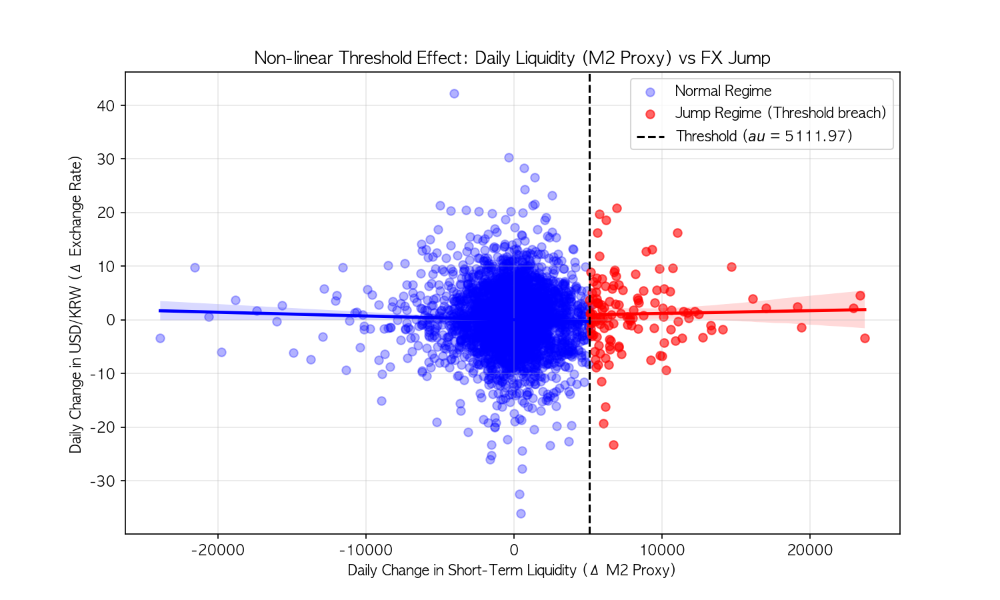

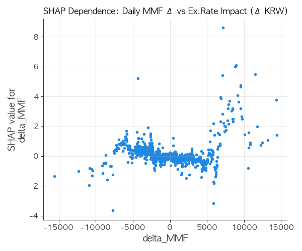

## 제 4절 Granger Causality 분석 방법

Granger causality 분석은 단기 유동성이 환율보다 먼저 움직이는지 확인하기 위한 시계열 검정이다. 어떤 변수 X의 과거값이 변수 Y의 현재 또는 미래값을 예측하는 데 유의한 정보를 제공한다면, X가 Y를 Granger-cause한다고 표현한다. 이는 경제학적 의미의 완전한 구조적 인과를 증명하는 것은 아니지만, 시간 순서와 예측력 관점에서 중요한 근거를 제공한다.

`analysis/m2_components/granger_causality_analysis.py`는 먼저 `analysis/anomaly/anomaly_concatenated_dataset.csv`를 불러온다. 이 데이터셋은 anomaly block을 결합한 자료로, 각 행에는 날짜, 환율, 금리차, 한국 M2, 미국 M2, 블록 시작일과 종료일, anomaly sequence day가 포함된다. 중요한 점은 변화율 계산을 전체 결합 시계열에서 직접 수행하지 않고, `block_start` 기준으로 그룹화한 뒤 각 블록 내부에서만 `pct_change()`를 계산한다는 것이다.

이 처리는 anomaly block 분석에서 매우 중요하다. 서로 떨어진 두 anomaly block 사이에는 실제 달력상 간격이 존재하지만, 단순히 이어붙인 데이터에서 바로 차분을 하면 한 블록의 마지막 날과 다음 블록의 첫날이 인접한 것처럼 계산된다. 이는 존재하지 않는 시계열 점프를 만들어 Granger 검정을 왜곡할 수 있다. 따라서 본 연구는 블록 내부에서만 FX 변화율과 M2 변화율을 계산하여 이러한 경계 왜곡을 줄였다.

검정은 두 방향으로 수행된다. 첫째, 환율 변화가 M2 변화를 선행하는지 확인하기 위해 `FX -> M2` 방향을 검정한다. 둘째, M2 변화가 환율 변화를 선행하는지 확인하기 위해 `M2 -> FX` 방향을 검정한다. 이상구간뿐 아니라 정상구간에서도 같은 검정을 수행하여, 해당 선행성이 일반적 현상인지 아니면 anomaly block이라는 특수한 국면에서 나타나는 현상인지 비교한다.

## 제 5절 예측 모델 검증 방법

예측 모델 검증은 단기 유동성 가설을 보조적으로 확인하기 위해 수행되었다. 본 연구에서 예측 모델의 목적은 모든 기간에서 환율 수준을 가장 정확하게 예측하는 절대 최적 모델을 만드는 것이 아니다. 핵심은 금리차만 사용한 모델과 금리차에 단기 유동성 변수를 추가한 모델을 비교하여, anomaly block 또는 이상구간에서 단기 유동성이 추가 설명력을 제공하는지 확인하는 것이다.

`analysis/LSTM/lstm_mmf`는 USD/KRW, RATE_SPREAD_KOR_USA, MMF_total을 사용한다. Model A는 USD/KRW와 금리차만 사용하고, Model B는 여기에 MMF_total을 추가한다. `analysis/LSTM/lstm_m2_demand_deposit`는 같은 구조에서 MMF 대신 `M2_수시입출식저축성예금`을 추가한다. 두 모델 모두 sequence length 30일, 5영업일 ahead 예측 구조를 사용한다.

Naive baseline에 대한 해석은 주의해야 한다. 환율 시계열은 직전 값의 설명력이 매우 강하기 때문에, 정답 시계열을 한 시점 이동한 persistence baseline은 구조적으로 강한 기준선이 된다. 따라서 LSTM이나 Hybrid 모델이 naive baseline을 항상 압도하지 못한다고 해서 모델의 신뢰성이 낮다고 해석해서는 안 된다. 본 연구에서 더 중요한 비교는 naive baseline과의 절대 우열이 아니라, 금리차 단독 모델 대비 단기 유동성 추가 모델이 anomaly block에서 상대적으로 더 나은 설명력을 보이는지이다.

Hybrid 모델은 ARIMA 또는 SARIMAX가 포착하지 못한 잔차 패턴을 LSTM 또는 CNN-LSTM으로 보완하는 구조이다. `analysis/LSTM/Hybrid`에는 MMF 기반, M2 수시입출식저축성예금 기반, 로그수익률 기반 multi-step 예측 결과가 저장되어 있다. 이 모델들은 환율 예측의 난이도와 단기 유동성 변수의 조건부 설명력을 검토하는 보조 증거로 활용된다.

---

# 제 4장 분석 결과

## 제 1절 장기 환율 요인 및 Anomaly Block 분석

장기 분석 결과는 환율과 주요 거시 변수 사이에 일정한 평균 관계가 있음을 보여준다. `analysis/baseline/result.md`에 따르면 장기 구간에서 M2와 CPI는 환율과 강한 양의 상관관계를 보였고, 금리차는 환율과 음의 상관관계를 보였다. 이는 금리차가 환율에 일정한 방향성을 제공하고, 통화량과 물가 수준이 환율의 장기 레벨과 함께 움직일 수 있음을 시사한다.

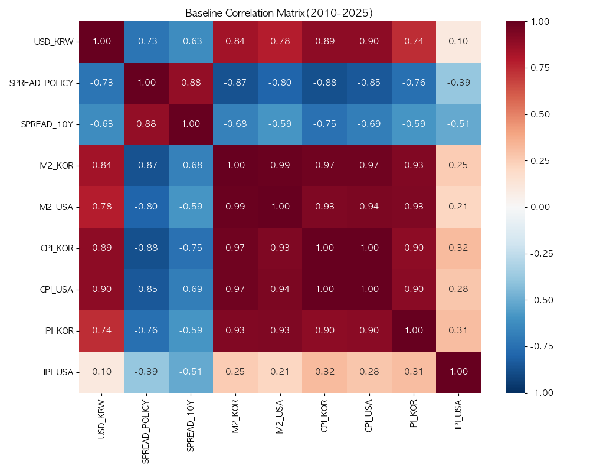

하지만 anomaly block 또는 기존 이상기간 분석에서는 이 관계가 약해지거나 달라졌다. `analysis/anomaly/result.md`는 장기 추세와 달리 이상기간에서 M2와 환율 사이의 선형 상관관계가 매우 낮게 나타났다고 설명한다. 이는 표면적으로는 “M2가 환율을 설명하지 못한다”는 결론처럼 보일 수 있다. 그러나 이 결과는 단기 유동성과 환율의 관계가 선형 상관계수로 포착되기 어려운 비선형 구조일 가능성을 열어준다.

고정기간 방식보다 anomaly block 방식이 중요한 이유는 여기에 있다. 고정기간 방식은 최근 고환율 구간의 평균적 특징을 보여줄 수 있지만, 금리차와 환율이 실제로 디커플링되는 모든 시점을 포착하지 못한다. 반면 anomaly block은 30일 rolling correlation을 사용하여 금리차-환율 관계가 특정 기준 이하로 약화되는 시점을 데이터 기반으로 추출한다. 따라서 “금리차가 작동하지 않는 시장 상태”라는 연구 질문에 더 직접적으로 대응한다.

확인된 anomaly block 데이터셋은 3,588개 관측치를 포함한다. 전체 블록 수는 668개이며, 분석 기간은 1995년 1월 31일부터 2026년 3월 20일까지이다. 이처럼 anomaly block은 단일 사건이 아니라 여러 시점에 반복되는 디커플링 상태의 집합이다. 본 연구는 이 집합을 하나의 특수 레짐으로 보고, 그 안에서 단기 유동성이 환율을 설명하는지 검토한다.

| 구분 | 정의 | 장점 | 한계 |
|---|---|---|---|
| 고정기간 이상구간 | 연구자가 특정 기간을 사전 지정 | 설명이 직관적이고 최근 사건 분석에 유리 | 기간 선택의 자의성, 과거 반복 구간 누락 |
| Anomaly block | rolling correlation으로 디커플링 구간 탐지 | 금리차 설명력 약화 구간을 데이터 기반 추출 | 블록 연결 시 시차 해석 주의 필요 |

## 제 2절 SHAP 기반 환율 변동 요인 분석

SHAP 분석은 본 프로젝트에서 중요한 전환점을 제공했다. 선형 상관관계 분석에서는 anomaly 구간에서 M2와 환율의 관계가 낮게 나타났지만, Random Forest 및 SHAP 분석에서는 M2, 특히 단기성 자금 계열 변수가 환율 상승에 중요한 변수로 나타났다. 이는 선형 분석과 비선형 머신러닝 분석 사이의 차이를 보여준다.

`analysis/shap_ml/result.md`에 따르면 이상기간 동안 환율 상승에 가장 크게 기여한 변수를 파악하기 위해 Random Forest 모델과 SHAP 기여도 분석을 수행했다. 결과적으로 금리차보다 M2, 특히 단기성 자금이 환율 상승에 크게 기여한 변수로 나타났다. 이 결과는 금리차 중심 설명만으로는 anomaly block의 환율 움직임을 충분히 설명하기 어렵다는 점을 보완한다.

SHAP 분석의 장점은 변수의 평균 중요도뿐 아니라 예측값을 상승시키는 방향과 크기를 함께 해석할 수 있다는 점이다. 예를 들어 어떤 시점에서 M2 또는 단기 유동성 값이 높을 때 SHAP value가 양수로 크게 나타난다면, 해당 변수는 모델이 환율 상승을 예측하는 데 기여한 것으로 해석할 수 있다. 이는 단순 상관계수보다 anomaly block의 비선형 관계를 포착하는 데 적합하다.

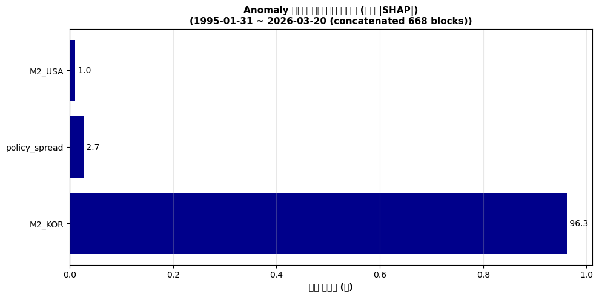

중요한 것은 이 결과를 과도하게 인과적으로 단정하지 않는 것이다. SHAP은 모델 예측에 대한 기여도를 설명하는 도구이지, 경제학적 구조 인과를 직접 증명하는 도구는 아니다. 따라서 본 연구는 SHAP 결과를 “단기 유동성이 anomaly block에서 환율 움직임을 설명하는 데 중요한 정보로 사용되었다”는 근거로 해석하고, 이후 threshold regression과 Granger causality를 통해 비선형성 및 시간 선행성을 추가로 검증한다.

## 제 3절 M2 구성요소 및 단기 유동성 분석

M2 총량은 다양한 성격의 통화성 자산을 포함한다. 따라서 M2가 환율 설명에 중요하다는 결과만으로는 어떤 자금이 실제로 환율 불안과 관련되는지 알기 어렵다. 본 연구는 M2를 구성요소별로 분해하여 단기성 자금이 anomaly 구간에서 얼마나 증가했는지 확인하였다.

`analysis/m2_components/result.md`에 따르면 이상기간 동안 M2 구성 항목 중 특히 단기성 예금류 자금이 크게 증가한 것으로 나타났다. 기존 중간보고서 `reports/legacy/report_mid.typ`와 `reports/legacy/report_exchange_rate_analysis.md`에는 수시입출식저축성예금, 요구불예금, MMF 등이 단기 부동자금으로 해석되어 있으며, 이들이 전체 증가분에서 큰 비중을 차지했다는 내용이 정리되어 있다.

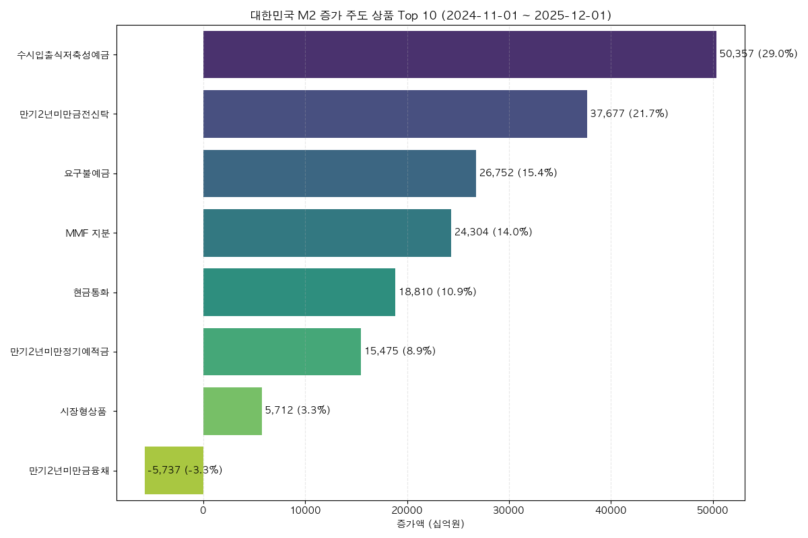

기존 보고서 기준으로 M2 증가분 중 수시입출식저축성예금은 약 50.4조 원, 요구불예금은 약 26.8조 원, MMF는 약 24.3조 원 증가한 것으로 정리되어 있다. 이 수치는 `report_mid.typ`와 `report_exchange_rate_analysis.md`에서 확인되는 기존 보고서 기준 수치이며, 최종 제출 전 최신 `M2_details_processed.csv` 기준으로 재산출해 검증하는 것이 좋다.

| 항목 | 증가액 | 기여도 | 해석 |
|---|---:|---:|---|
| 수시입출식저축성예금 | 약 +50.4조 원 | 약 29.0% | 즉시 이동 가능한 단기성 예금 |
| 요구불예금 | 약 +26.8조 원 | 약 15.4% | 이자보다 유동성이 중요한 대기성 자금 |
| MMF | 약 +24.3조 원 | 약 14.0% | 단기 금융상품 대기 자금 |
| 현금통화 | 약 +18.8조 원 | 약 10.9% | 실물 현금성 자금 |

이 분석의 핵심은 M2 전체가 아니라 “M2 내부의 어떤 자금이 환율 불안과 연결될 가능성이 큰가”이다. 만기성 예금이나 장기 금융상품보다 수시입출식저축성예금, 요구불예금, MMF처럼 이동성이 높은 자금은 환율 상승 기대나 위험회피 심리가 커질 때 빠르게 달러 수요로 전환될 수 있다. 따라서 본 연구는 M2 총량보다 단기 유동성 구성요소를 더 중요한 설명 변수로 해석한다.

## 제 4절 단기 유동성 임계점 가설 검증

단기 유동성 임계점 가설은 본 연구의 핵심이다. 이 가설은 단기 유동성이 증가할수록 환율이 선형적으로 함께 상승하는 것이 아니라, 일정 수준을 넘으면 환율 반응이 급격히 커지는 구조를 가정한다. 이 가설은 선형 상관분석과 SHAP 분석의 차이를 설명하는 논리적 연결고리이다.

`analysis/daily_threshold_MMF/result.md`는 일별 단기 유동성 데이터(CMA, MMF)를 합친 대리 지표를 활용해 threshold regression을 수행한 결과를 요약한다. 기존 결과 문서에 따르면 일일 유동성이 약 5.1조 원 이상 증가하는 threshold를 넘는 날 환율이 비선형적으로 크게 점프하는 구조적 변화가 확인되었다. 또한 이 threshold를 돌파한 날이 과거 평균보다 이상기간에 더 자주 발생했다는 결과가 제시되어 있다.


이 결과는 “M2와 환율의 선형 상관이 낮다”는 결과와 “M2가 SHAP에서 중요하다”는 결과가 반드시 모순이 아님을 보여준다. 유동성이 환율에 영향을 미치는 방식이 선형이 아니라 임계점 기반이라면, 전체 구간 평균 상관계수는 낮게 나올 수 있다. 하지만 threshold를 넘는 특정 관측치에서는 유동성이 환율 상승에 매우 큰 기여를 할 수 있다.

`analysis/daily_shap_MMF/result.md`는 MMF와 CMA를 구분하여 SHAP dependence plot을 해석한다. 결과 문서에 따르면 MMF의 경우 일일 자금 증가분이 특정 수준을 초과하면 환율 상승에 미치는 SHAP value가 가파르게 상승하는 패턴이 관찰되었다. 반면 CMA의 경우 같은 임계점 돌파 패턴이 명확하게 나타나지 않았다. 이는 단기 유동성 중에서도 MMF가 환율 급등 가설을 더 강하게 뒷받침하는 변수일 수 있음을 시사한다.


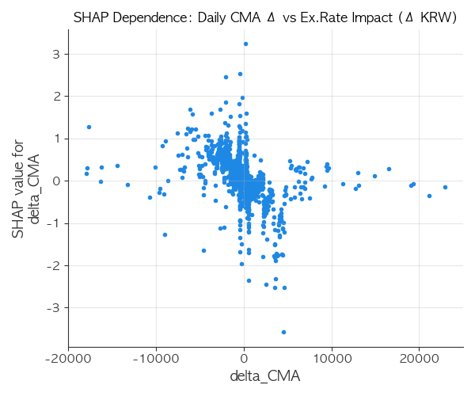

물론 threshold 분석 역시 완전한 인과 증명은 아니다. threshold는 관측 데이터에 기반해 탐색된 값이므로 표본 기간, 변수 구성, 결측 처리, threshold 후보 범위에 따라 달라질 수 있다. 따라서 본 연구는 threshold 결과를 단독 결론으로 사용하지 않고, M2 구성요소 분석, SHAP dependence, Granger causality, 예측 모델 결과와 함께 종합적으로 해석한다.

## 제 5절 Granger Causality 분석 결과

Granger causality 분석은 본 연구의 가장 중요한 검증 중 하나이다. `analysis/m2_components/granger_result.md`에 따르면 anomaly block에서 M2 변화가 환율 변화를 선행하는 방향은 통계적으로 유의한 반면, 환율 변화가 M2 변화를 선행하는 방향은 유의하지 않았다. 이는 단기 유동성이 단순히 환율과 함께 움직이는 것이 아니라, 시계열 관점에서 환율 변화보다 먼저 나타나는 정보를 포함할 가능성을 보여준다.

이상구간 검정 결과를 보면 `FX -> M2` 방향은 Lag 1, Lag 2, Lag 3에서 모두 유의하지 않았다. 반면 `M2 -> FX` 방향은 Lag 1에서 F=12.4305, p=0.0004, Lag 2에서 F=25.7423, p≈0.0000, Lag 3에서 F=19.7330, p≈0.0000으로 유의하게 나타났다. 이는 M2의 과거 변화가 환율 변화를 예측하는 데 통계적으로 유의한 정보를 제공한다는 의미이다.

| 방향 | Lag | F-통계량 | p-value | 결과 |
|---|---:|---:|---:|---|
| FX -> M2 | 1 | 0.0956 | 0.7572 | 유의하지 않음 |
| FX -> M2 | 2 | 0.1223 | 0.8849 | 유의하지 않음 |
| FX -> M2 | 3 | 0.5040 | 0.6795 | 유의하지 않음 |
| M2 -> FX | 1 | 12.4305 | 0.0004 | 유의함 |
| M2 -> FX | 2 | 25.7423 | 0.0000 | 유의함 |
| M2 -> FX | 3 | 19.7330 | 0.0000 | 유의함 |

정상구간에서는 같은 방향의 관계가 유의하지 않았다. `granger_result.md`에 따르면 일반구간에서 `FX -> M2` Lag 2는 p=0.9685, `M2 -> FX` Lag 2는 p=0.1723으로 유의하지 않았다. 따라서 M2가 환율을 선행하는 구조는 모든 구간에서 일반적으로 작동하는 법칙이라기보다, 금리차 설명력이 약화되는 anomaly block에서 두드러지는 국면 특화적 현상으로 해석하는 것이 적절하다.

이 결과는 본 연구의 핵심 메시지를 강하게 뒷받침한다. 금리차와 환율이 전통적 관계를 보이지 않는 구간에서 단기 유동성이 환율 움직임을 설명하는 데 중요한 정보로 작동한다는 주장은 SHAP 분석만으로는 예측 기여도 수준에 머문다. 그러나 Granger causality 결과는 시간 순서 관점에서 M2 변화가 환율 변화보다 선행하는 통계적 근거를 제공한다.

다만 Granger causality는 구조적 인과관계를 완전히 증명하지 않는다. 예를 들어 제3의 외생 충격이 M2와 환율을 동시에 움직이게 할 가능성은 여전히 존재한다. 따라서 본 연구는 “M2가 환율을 구조적으로 직접 발생시킨다”고 단정하기보다는, “anomaly block에서 M2 변화가 환율 변화를 선행하며, 환율 움직임을 예측하는 데 유의한 정보를 제공한다”고 해석한다.

## 제 6절 예측 모델을 통한 설명력 검증

예측 모델 결과는 단기 유동성 가설을 보조적으로 검증한다. 본 연구에서 가장 중요한 비교는 금리차 단독 모델과 금리차에 단기 유동성 변수를 추가한 모델의 상대적 성능이다. 특히 anomaly block 또는 이상구간에서 유동성 변수를 추가했을 때 성능이 개선되는지를 확인한다.

MMF 기반 LSTM 결과를 보면 전체 구간에서는 금리차 단독 모델이 근소하게 우수하거나 유사한 결과를 보였다. `analysis/LSTM/lstm_mmf/results.json` 기준 전체 구간에서 Model A의 RMSE는 43.98, Model B의 RMSE는 44.48로 Model A가 약간 우수했다. 그러나 고정 이상구간 `2024-11~2026-03`에서는 Model A의 RMSE가 21.06, Model B의 RMSE가 18.77로 유동성 변수를 추가한 Model B가 더 나은 결과를 보였다.

Anomaly block 전체를 대상으로 한 extended 결과에서는 차이가 더 분명하다. `analysis/LSTM/lstm_mmf/results_extended.json`에 따르면 evaluated block은 546개이며, Model A의 weighted RMSE는 21.16, Model B의 weighted RMSE는 16.62이다. weighted MAE 역시 Model A 19.50, Model B 14.32로 감소했다. 이는 anomaly block에서 MMF 변수가 금리차 단독 모델보다 환율 움직임을 설명하는 데 추가 정보를 제공했음을 보여준다.

수시입출식저축성예금 기반 LSTM에서도 유사한 방향의 결과가 관찰된다. `analysis/LSTM/lstm_m2_demand_deposit/results.json` 기준 전체 구간에서는 Model A가 RMSE 44.62, Model B가 RMSE 64.00으로 금리차 단독 모델이 우수했다. 그러나 고정 이상구간에서는 Model A RMSE 21.21, Model B RMSE 18.98로 단기 유동성 추가 모델이 개선되었다. extended anomaly block 결과에서는 Model A weighted RMSE 15.07, Model B weighted RMSE 14.89로 차이는 작지만 Model B가 더 낮았다.

| 모델 구성 | 평가 구간 | Model A RMSE | Model B RMSE | 해석 |
|---|---|---:|---:|---|
| MMF LSTM | 전체 구간 | 43.98 | 44.48 | 전체 평균에서는 금리차 단독이 근소 우위 |
| MMF LSTM | 고정 이상구간 | 21.06 | 18.77 | MMF 추가 모델 우위 |
| MMF LSTM | anomaly block extended | 21.16 | 16.62 | MMF 추가 모델 우위 |
| 수시입출식저축성예금 LSTM | 전체 구간 | 44.62 | 64.00 | 전체 평균에서는 금리차 단독 우위 |
| 수시입출식저축성예금 LSTM | 고정 이상구간 | 21.21 | 18.98 | 유동성 추가 모델 우위 |
| 수시입출식저축성예금 LSTM | anomaly block extended | 15.07 | 14.89 | 유동성 추가 모델 근소 우위 |

이 결과는 단기 유동성 변수가 모든 기간에서 일관되게 환율 예측력을 높인다는 결론을 의미하지 않는다. 오히려 전체 구간에서는 금리차 또는 환율 자체의 관성이 더 안정적으로 작동하고, 단기 유동성 변수는 잡음으로 작용할 수 있다. 그러나 금리차 설명력이 약화되는 anomaly block에서는 MMF와 수시입출식저축성예금 같은 단기 유동성 변수가 추가 설명력을 제공한다는 조건부 결과가 나타난다.

Naive baseline과의 비교는 주의해서 해석해야 한다. Hybrid 실험에서 naive baseline은 사실상 정답 환율 시계열을 한 시점 이동한 persistence 기준선이므로, 환율처럼 자기상관이 강한 시계열에서는 매우 강력한 비교 대상이다. 따라서 모델이 naive baseline을 압도하지 못했다는 사실을 단기 유동성 가설의 신뢰성을 낮추는 근거로 사용해서는 안 된다. 본 연구의 핵심은 “절대적으로 가장 낮은 RMSE를 내는가”가 아니라 “금리차 단독 설명이 약화되는 구간에서 단기 유동성 추가가 상대적으로 설명력을 개선하는가”이다.

Hybrid 모델 결과는 이 관점을 보조한다. 로그수익률 기반 MMF Hybrid 결과에서는 anomaly concatenated blocks에서 LSTM 계열 모델의 RMSE가 naive baseline과 유사하거나 일부 더 낮게 나타났다. CPI 통합 실험은 단기 예측 성능을 뚜렷하게 개선하지 못했으며, 이는 CPI 같은 월별 후행성 지표보다 단기 유동성 지표가 anomaly block의 단기 환율 움직임을 설명하는 데 더 직접적일 수 있음을 시사한다.

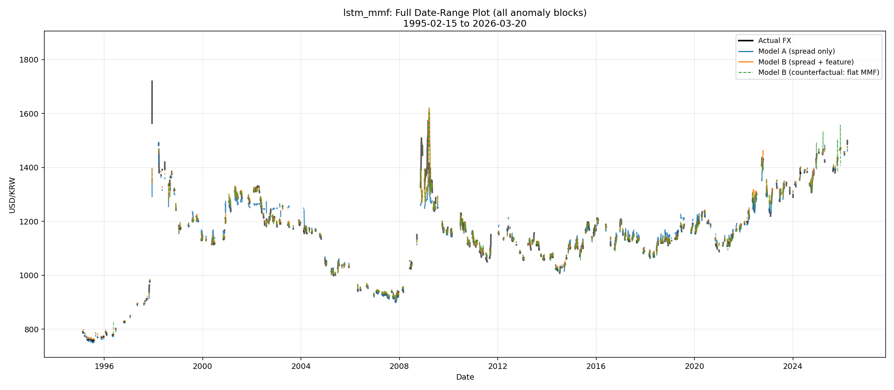

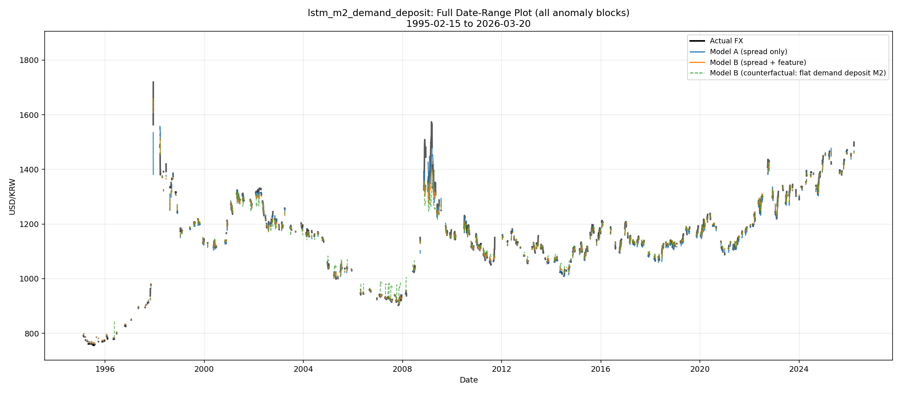

## 제 7절 환율 영향 분석 확장

`analysis/fx_impact`는 본 연구의 핵심인 “단기 유동성이 환율을 설명하는가”에서 한 단계 확장하여, 환율 충격이 이후 국내 거시·금융 변수에 어떤 영향을 미치는지 분석한다. 이 단계는 본 보고서의 중심 결론은 아니지만, 향후 연구와 실무 적용 가능성을 보여주는 확장 분석으로 의미가 있다.

`analysis/fx_impact/result.md`에 따르면 최종 파이프라인은 anomaly event month에서 USD/KRW 환율이 움직였을 때 국내 거시·금융 변수들이 이후 1~6개월 동안 어떤 방향과 크기로 반응하는지 추정한다. 대상 변수는 CSI_CCSI, Imports, KOSPI, Industrial_Production, Import_Price_Index, Foreign_Bond_Investment, Foreign_Stock_Investment, Trade_Balance 등이다.

초기 방식은 anomaly month를 필터링한 뒤 하나의 시계열처럼 이어붙여 예측하는 방식이었으나, 이 방식은 실제 calendar gap을 제거하여 lag 해석을 왜곡할 수 있다는 문제가 있었다. 최종 파이프라인은 이를 보완하기 위해 event-time local projection 방식을 사용한다. 즉 `(event_date, target, horizon)` 단위의 패널을 만들고, lag와 response는 원래 월별 calendar index에서 가져온다.

분석 결과 predicted FX 기준으로 LocalProjection_ElasticNet, Ridge, OLS 모델이 비교되었고, target별로 가장 적합한 모델이 선택되었다. 예를 들어 CSI_CCSI, Foreign_Bond_Investment, Imports 등은 비교적 안정적인 target으로 제시되었고, Import_Price_Index, Industrial_Production, KOSPI, Trade_Balance는 해석에 더 주의가 필요한 target으로 정리되었다. 이는 환율 충격이 모든 변수에 동시에 같은 방식으로 전달되는 것이 아니라, 변수별로 반응 시점과 안정성이 다르다는 점을 보여준다.

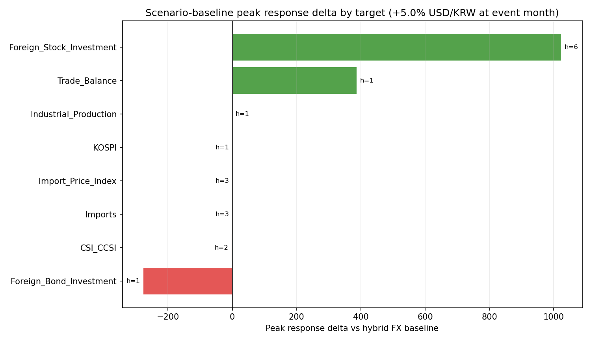

본 보고서에서는 fx_impact를 핵심 결론이 아니라 확장 가능성으로 다룬다. 핵심은 anomaly block에서 단기 유동성이 환율을 설명한다는 점이며, fx_impact는 이 환율 변동이 이후 거시경제 변수 예측으로 어떻게 이어질 수 있는지를 보여주는 후속 연구 방향이다. 향후에는 단기 유동성 기반 환율 위험지수와 fx_impact 모델을 결합하여, 환율 급등 가능성과 그 파급효과를 함께 예측하는 조기경보 시스템으로 발전시킬 수 있다.

---

# 제 5장 종합 논의

## 제 1절 연구 결과 종합

본 연구의 첫 번째 결과는 장기 구간과 anomaly block 구간의 환율 설명 구조가 다르다는 점이다. 장기적으로는 금리차, M2, CPI 등 거시 변수들이 환율과 일정한 관계를 보인다. 특히 금리차는 전통적 환율 설명 방식과 부합하는 방향성을 가진다. 그러나 금리차와 환율의 rolling correlation이 약화되는 anomaly block에서는 이러한 평균 관계가 충분하지 않다.

두 번째 결과는 SHAP 분석에서 단기 유동성 계열 변수가 중요하게 나타났다는 점이다. 선형 상관관계 분석에서는 anomaly 구간에서 M2와 환율의 관계가 낮게 보일 수 있지만, Random Forest 및 SHAP 분석에서는 M2와 단기성 자금이 환율 상승에 중요한 기여를 한 것으로 나타났다. 이는 단기 유동성과 환율 사이에 비선형 구조가 존재할 가능성을 제기한다.

세 번째 결과는 M2 내부 구성요소 중 단기성 자금의 중요성이다. 수시입출식저축성예금, 요구불예금, MMF는 장기성 자금보다 빠르게 이동할 수 있는 대기성 자금이다. 기존 보고서와 분석 결과는 anomaly 기간에 이러한 단기성 자금이 크게 증가했음을 보여준다. 이는 환율 불안 국면에서 달러 수요로 전환될 수 있는 유동성 압력이 커졌다는 해석을 가능하게 한다.

네 번째 결과는 임계점 가설이다. threshold regression과 SHAP dependence plot은 단기 유동성이 환율에 선형적으로만 영향을 미치는 것이 아니라, 특정 수준을 넘을 때 환율 반응이 급격히 커질 수 있음을 보여준다. 특히 MMF는 CMA보다 임계점 이후 환율 상승 기여도가 뚜렷하게 나타난 것으로 정리되어 있다.

다섯 번째 결과는 Granger causality 분석이다. anomaly block에서 M2 변화는 환율 변화를 선행하는 방향으로 유의했으며, 반대로 환율이 M2를 선행하는 방향은 유의하지 않았다. 정상구간에서는 이 관계가 유의하지 않았기 때문에, 단기 유동성의 선행성은 금리차 설명력이 약화되는 특수한 시장 국면에서 나타나는 조건부 현상으로 해석할 수 있다.

마지막으로 예측 모델 결과는 단기 유동성 가설을 보조한다. 전체 구간에서는 금리차 단독 모델이 더 안정적으로 작동할 수 있지만, anomaly block 또는 이상구간에서는 MMF와 수시입출식저축성예금 같은 단기 유동성 변수를 추가한 모델이 상대적으로 더 나은 설명력을 보였다. 이는 본 연구의 핵심 메시지와 일관된다.

## 제 2절 연구의 의의

본 연구의 첫 번째 의의는 기존 금리차 중심 환율 설명 방식의 한계를 보완했다는 점이다. 금리차는 환율 분석에서 여전히 중요한 변수이지만, 모든 국면에서 동일한 설명력을 가지지는 않는다. 본 연구는 금리차와 환율이 디커플링되는 anomaly block을 데이터 기반으로 정의하고, 그 구간에서 단기 유동성이 환율 움직임을 설명하는 데 중요한 역할을 한다는 점을 보였다.

두 번째 의의는 이상구간을 고정기간이 아니라 anomaly block으로 정의했다는 점이다. 특정 최근 기간을 임의로 이상구간으로 정하는 방식은 설명이 쉽지만 자의성이 크다. 반면 anomaly block 방식은 금리차와 환율의 관계가 실제로 약화되는 구간을 rolling correlation으로 탐지한다. 이는 연구 질문과 분석 대상이 더 직접적으로 연결되도록 만든다.

세 번째 의의는 단기 유동성의 비선형적 영향 가능성을 제시했다는 점이다. 단순 상관관계 분석에서는 M2와 환율의 관계가 낮게 나타날 수 있지만, SHAP과 threshold regression은 특정 임계점 이후 단기 유동성의 환율 영향력이 급격히 커질 수 있음을 보여준다. 이는 “환율은 평균적으로 어떤 변수와 함께 움직이는가”에서 “어떤 국면과 조건에서 특정 변수가 환율을 움직이는가”로 분석 관점을 확장한다.

네 번째 의의는 Granger causality를 통해 시간 순서에 대한 근거를 보강했다는 점이다. SHAP 분석은 모델 기여도를 설명하지만 시간 선행성을 직접 보여주지는 않는다. 반면 Granger causality 결과는 anomaly block에서 M2 변화가 환율 변화를 선행한다는 통계적 근거를 제공한다. 이는 단기 유동성을 단순 동행 지표가 아니라 조기경보 지표 후보로 볼 수 있게 한다.

다섯 번째 의의는 실무적 확장 가능성이다. 단기 유동성 임계점, anomaly block 탐지, Granger 선행성, 예측 모델 결과를 결합하면 환율 리스크 조기경보 시스템으로 발전시킬 수 있다. 예를 들어 MMF, 요구불예금, 수시입출식저축성예금의 증가 속도와 금리차-환율 디커플링 정도를 함께 모니터링하여 환율 급등 위험지수를 만들 수 있다.

## 제 3절 연구의 한계

본 연구의 첫 번째 한계는 구조적 인과관계의 한계이다. Granger causality는 시간 순서와 예측력 관점의 인과성을 보여주지만, 경제학적 의미의 완전한 구조 인과를 증명하지는 않는다. 제3의 외생 충격, 정책 이벤트, 글로벌 위험회피 심리, 달러 유동성 충격 등이 M2와 환율을 동시에 움직였을 가능성은 남아 있다.

두 번째 한계는 데이터 빈도와 보간 문제이다. 환율과 일부 금융 변수는 일별 데이터이지만, M2 구성요소나 CPI, 산업생산 등은 월별 데이터이다. 월별 데이터를 일별로 보간하면 모델 입력에는 사용할 수 있지만, 실제 정보가 매일 새롭게 관측되는 것처럼 해석하면 안 된다. 특히 예측 모델에서 보간된 월별 변수의 시차 구조는 신중하게 해석해야 한다.

세 번째 한계는 anomaly block 연결 방식의 해석 문제이다. anomaly block은 금리차-환율 디커플링 구간을 데이터 기반으로 추출한다는 장점이 있지만, 서로 떨어진 구간을 하나의 regime으로 묶을 때 실제 달력상의 간격이 제거될 수 있다. 본 연구는 Granger 분석에서 블록 내부 차분을 사용해 이를 보완했지만, 모든 분석에서 이 문제가 완전히 제거된 것은 아니다.

네 번째 한계는 일부 결과 문서와 최신 데이터셋 사이의 정합성 문제이다. 예를 들어 초기 보고서에는 CMA와 MMF를 합친 M2 proxy 분석이 포함되어 있으나, 현재 확인된 `merged_daily_liquid.csv`는 MMF_total 중심으로 구성되어 있다. 또한 고정기간 이상구간 결과와 anomaly block 결과가 혼재되어 있으므로 최종 제출 전 어떤 결과를 본문 핵심으로 사용할지 정리해야 한다.

다섯 번째 한계는 예측 모델 성능 해석이다. 환율은 자기상관이 강하고, naive baseline이 매우 강한 기준선이 될 수 있다. 따라서 모델의 절대 RMSE만으로 경제적 설명력을 판단하기 어렵다. 본 연구는 금리차 단독 모델과 유동성 추가 모델의 상대 비교에 초점을 두었지만, 향후에는 walk-forward validation, 실시간 데이터 기준 검증, 외생 이벤트 통제 등을 추가할 필요가 있다.

---

# 제 6장 결론 및 향후 연구 방향

## 제 1절 결론

본 연구는 한미 금리차로 환율을 설명하기 어려운 anomaly block 구간에서 단기 유동성이 원/달러 환율 움직임을 설명할 수 있는지 분석하였다. 연구 결과, 장기 구간에서는 금리차와 환율 사이에 전통적 관계가 어느 정도 관찰되지만, 금리차-환율 관계가 약화되는 anomaly block에서는 단기 유동성 변수가 더 중요한 설명 정보를 제공하는 것으로 나타났다.

SHAP 분석은 anomaly 구간에서 M2 및 단기성 자금 계열 변수가 환율 상승에 중요한 기여를 했음을 보여주었다. M2 구성요소 분석은 수시입출식저축성예금, 요구불예금, MMF 등 이동성이 높은 단기성 자금이 중요한 역할을 할 가능성을 제시했다. 이는 M2 총량보다 M2 내부의 유동성 성격을 구분해 분석해야 함을 의미한다.

임계점 분석은 단기 유동성과 환율 사이의 관계가 단순 선형이 아닐 수 있음을 보여준다. 기존 결과 문서 기준으로 일일 유동성이 특정 threshold를 넘는 구간에서 환율 반응이 급격히 커지는 패턴이 관찰되었고, MMF SHAP dependence plot에서도 특정 수준 이후 환율 상승 기여도가 가파르게 증가하는 모습이 확인되었다. 이는 단기 유동성 임계점 가설을 뒷받침한다.

Granger causality 분석은 본 연구의 핵심 근거이다. anomaly block에서 M2 변화는 환율 변화를 선행하는 방향으로 유의했고, 환율이 M2를 선행하는 방향은 유의하지 않았다. 정상구간에서는 이러한 관계가 나타나지 않았다. 따라서 본 연구는 단기 유동성이 모든 시기에 환율을 설명하는 보편 변수라기보다, 금리차 설명력이 약화되는 anomaly block에서 조건부로 강한 설명력과 선행성을 갖는 변수라고 결론짓는다.

예측 모델 결과도 이 결론을 보조한다. 전체 구간에서는 금리차 단독 모델이 더 안정적인 경우가 있었지만, 이상구간 또는 anomaly block에서는 MMF와 수시입출식저축성예금 같은 단기 유동성 변수를 추가한 모델이 상대적으로 더 좋은 결과를 보였다. Naive baseline은 강한 persistence 기준선이므로, 모델이 이를 압도하지 못한 점을 단기 유동성 가설의 반증으로 해석해서는 안 된다.

## 제 2절 향후 연구 방향

첫 번째 향후 과제는 실시간 단기 유동성 모니터링 체계 구축이다. 본 연구에서 중요하게 나타난 MMF, 수시입출식저축성예금, 요구불예금 등의 변화를 주기적으로 수집하고, 금리차-환율 rolling correlation과 함께 모니터링하면 환율 불안 구간을 조기에 감지할 수 있다.

두 번째 과제는 환율 리스크 조기경보 지수 개발이다. 단기 유동성 증가율, threshold 초과 여부, anomaly block 진입 여부, 금리차 변화, 환율 변동성, DXY, VIX 등을 결합하여 0~100 사이의 위험지수를 산출하는 시스템으로 확장할 수 있다. 이 지수는 정책 판단, 기업 환헤지, 투자 리스크 관리에 활용될 수 있다.

세 번째 과제는 외생 충격과 정책 이벤트 반영이다. 본 연구는 주로 거시금융 시계열을 활용했지만, 환율은 정책 발표, 지정학적 이벤트, 글로벌 금융 불안, 중앙은행 커뮤니케이션 등에 민감하게 반응한다. 향후에는 이벤트 더미, 뉴스 기반 지표, 변동성 지표, 글로벌 달러 유동성 지표를 추가하여 단기 유동성 효과와 외생 충격 효과를 구분할 필요가 있다.

네 번째 과제는 환율 충격의 거시경제 파급효과 분석 고도화이다. `fx_impact` 분석은 환율 충격이 KOSPI, 수입물가, 무역수지, 외국인 투자 등으로 어떻게 전달되는지 탐색한다. 향후에는 단기 유동성 기반 환율 예측과 event-time local projection을 결합하여 “유동성 충격 → 환율 급등 → 국내 거시 변수 반응”의 연쇄 구조를 하나의 시스템으로 모델링할 수 있다.

마지막으로 예측 모델의 실시간 검증이 필요하다. 현재 분석은 대부분 과거 데이터를 기반으로 한 사후 검증이다. 조기경보 시스템으로 발전시키려면 실제 관측 가능한 시점의 데이터만 사용한 walk-forward 방식의 평가, 데이터 발표 지연 반영, 실시간 API 수집 자동화, 모델 업데이트 절차가 필요하다.

---

# 참고문헌

## 국내문헌

- 한국은행 경제통계시스템(ECOS), 주요 거시경제 및 금융 통계.
- 기존 프로젝트 보고서: `reports/legacy/report_mid.typ`, `reports/legacy/report_3w.typ`, `reports/legacy/report_exchange_rate_analysis.md`.
- 홍난영, 이윤재, 이태욱. (2023). Hybrid SARIMAX-LSTM 알고리즘을 이용한 시계열 자료 예측. 한국데이터정보과학회지, 34(5), 697-709. 기존 중간보고서 참고문헌 기준.

## 국외문헌

- Federal Reserve Economic Data(FRED), 미국 CPI, M2, 금리, 산업생산 등.
- SHAP: Lundberg and Lee의 Shapley Additive Explanations 관련 연구. 정확한 서지 정보는 최종 제출 전 보완 필요.
- Granger causality 관련 원 논문 서지 정보는 최종 제출 전 보완 필요.

## 데이터 출처

- 한국은행 경제통계시스템: https://ecos.bok.or.kr/
- Federal Reserve Economic Data: https://fred.stlouisfed.org/
- 프로젝트 내부 전처리 데이터: `/Applications/dollar_price/data`
- 프로젝트 분석 산출물: `/Applications/dollar_price/analysis`

---

# 부록

## 부록 1. 주요 변수 설명

| 변수명 | 의미 | 사용 위치 |
|---|---|---|
| `USD_KRW`, `FX_rate` | 원/달러 환율 | 전체 분석 |
| `RATE_SPREAD_KOR_USA`, `policy_spread` | 한국 기준금리 - 미국 정책금리 | anomaly block 정의, 예측 모델 |
| `M2_KOR` | 한국 광의통화 | 장기 분석, Granger 분석 |
| `M2_USA` | 미국 M2 | 장기 통합 데이터 |
| `M2_수시입출식저축성예금` | 한국 M2 구성요소 중 단기성 예금 | LSTM 및 M2 구성요소 분석 |
| `M2_요구불예금` | 즉시 인출 가능한 예금 | M2 구성요소 분석 |
| `MMF_total`, `M2_MMF` | MMF 유동성 | 임계점 분석, LSTM |
| `CPI_KOR`, `CPI_USA` | 한국/미국 소비자물가지수 | 장기 분석, 보조 실험 |
| `KOSPI` | 한국 주가지수 | fx_impact 확장 분석 |
| `Foreign_Stock_Investment` | 외국인 주식투자 | fx_impact 확장 분석 |
| `Foreign_Bond_Investment` | 외국인 채권투자 | fx_impact 확장 분석 |

## 부록 2. 분석 코드 및 실행 절차

대표 실행 명령어는 다음과 같다.

```bash
python data/process_scripts/process_all_indicators.py
python data/process_scripts/rebuild_daily_pipeline.py
python data/process_scripts/create_daily_integrated_dataset.py
```

```bash
python analysis/baseline/analyze_factors.py
python analysis/anomaly/generate_dynamic_periods.py
python analysis/anomaly/detect_anomaly_period.py
python analysis/shap_ml/analyze_shap.py
python analysis/m2_components/analyze_m2_components.py
python analysis/m2_components/granger_causality_analysis.py
python analysis/daily_threshold_MMF/analyze_daily_threshold.py
python analysis/daily_shap_MMF/analyze_daily_shap.py
```

```bash
python analysis/LSTM/lstm_mmf/prep_daily.py
python analysis/LSTM/lstm_mmf/train_eval_extended.py
python analysis/LSTM/lstm_m2_demand_deposit/prep_m2_demand_deposit.py
python analysis/LSTM/lstm_m2_demand_deposit/train_eval_extended.py
python analysis/fx_impact/run_final_fx_impact_pipeline.py
```

## 부록 3. 추가 분석 결과표

| 결과물 | 파일 경로 | 내용 |
|---|---|---|
| Baseline heatmap | `analysis/baseline/exchange_rate_heatmap.png` | 장기 상관관계 |
| Anomaly comparison | `analysis/anomaly/correlation_comparison_updated.png` | 정상/이상 상관관계 비교 |
| SHAP summary | `analysis/shap_ml/shap_summary_anomaly.png` | anomaly 구간 SHAP |
| M2 component plot | `analysis/m2_components/m2_components_analysis.png` | M2 구성요소 증가 |
| Granger result | `analysis/m2_components/granger_result.md` | M2-FX 선행성 검정 |
| Threshold plot | `analysis/daily_threshold_MMF/threshold_regression_daily.png` | 임계점 회귀 |
| MMF SHAP dependence | `analysis/daily_shap_MMF/daily_shap_dependence_mmf.png` | MMF 비선형성 |
| LSTM MMF metrics | `analysis/LSTM/lstm_mmf/results_extended.json` | anomaly block 예측 성능 |
| LSTM demand deposit metrics | `analysis/LSTM/lstm_m2_demand_deposit/results_extended.json` | anomaly block 예측 성능 |
| FX impact result | `analysis/fx_impact/result.md` | 환율 영향 확장 분석 |

---

# 확인 필요 사항

1. M2 구성요소별 증가액과 기여도는 기존 보고서 기준 수치를 사용하였다. 최종 제출 전 `M2_details_processed.csv` 기준으로 재산출하여 표 수치를 확정해야 한다.
2. `daily_threshold_MMF/result.md`는 CMA와 MMF를 합친 대리 지표를 언급하지만, 현재 확인된 `merged_daily_liquid.csv`는 `MMF_total` 중심이다. CMA 원천 파일과 최신 파이프라인 반영 여부를 확인해야 한다.
3. 일부 이미지 파일 경로는 기존 산출물 기준이다. Markdown을 PDF나 Typst로 변환하기 전 상대 경로가 정상적으로 렌더링되는지 확인해야 한다.
4. 참고문헌의 국외문헌 서지 정보는 최종 보고서 양식에 맞추어 보완해야 한다.
5. anomaly block 기준은 `period_definition.json`의 rolling window 30일, threshold -0.2 설정을 사용하였다. 최종 보고서 제출 전 이 기준을 연구팀 최종 기준으로 확정해야 한다.

